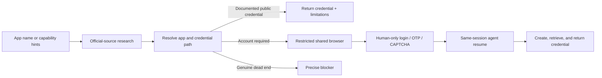

# GoFetch

> Turn an app name—or a description of the capability you need—into an evidence-backed API credential workflow.

GoFetch researches official API documentation, resolves the credential path, operates a restricted shared browser, pauses for human-only authentication, and resumes in the same session to create and retrieve the credential.

<p align="center">
  <a href="https://gofetch-zw8v.onrender.com"></a>
  <a href="https://www.loom.com/share/e977968a7a9f43e88875875e01327d72"></a>
  
</p>

## Demo

[](https://www.loom.com/share/e977968a7a9f43e88875875e01327d72)

**[Watch the end-to-end GoFetch demo on Loom →](https://www.loom.com/share/e977968a7a9f43e88875875e01327d72)**

The public reviewer deployment is available at **[gofetch-zw8v.onrender.com](https://gofetch-zw8v.onrender.com)**. The free Render instance may take roughly 50 seconds to wake after inactivity.

## What GoFetch does

- Accepts a direct app name such as `Twilio` or `Composio`.
- Accepts clear requirements such as `an email delivery service with a free API`.
- Searches and fetches official sources without an app allowlist.
- Resolves one app and asks for confirmation when it selected the app from requirements.
- Returns a documented public credential immediately when official evidence contains one.
- Otherwise drives signup, login, developer settings, and API-key creation in a shared Browserbase session.
- Pauses inside that same browser for identity details, OTPs, magic links, CAPTCHAs, or third-party login.
- Resumes after handback and retrieves the credential itself.
- Reports an exact observed blocker instead of inventing a credential or workaround.

## Workflow



## Verified acceptance

| Scenario | Hosted result |
| --- | --- |
| Twilio direct input | User-verified successful hosted workflow |
| Composio direct input | User-verified login handoff, same-session resume, API-key creation, and credential return |
| NASA Open APIs | Returned the official documented `DEMO_KEY` path without browser signup |
| Capability-description input | Dynamically selected an evidence-backed app and required confirmation before acting |
| Ambiguous input | Asked one focused clarification question |
| Quality gate | 104 Vitest tests, TypeScript, ESLint, and production build passing |

The detailed acceptance record is in [submission.md](./submission.md), while the complete incremental evidence is in [progress.md](./progress.md).

## Safety model

- Provider keys remain server-side environment variables.
- Browser navigation is constrained to researched HTTPS domains and verified related account domains.
- Page content, search snippets, and user input are treated as untrusted model data.
- GoFetch never enters payment or card information and never auto-solves CAPTCHAs.
- Human values are ephemeral; acquired credentials and personal data are not persisted by GoFetch.
- Browser recording and session logging are disabled.
- One active browser run, rapid-start throttling, timeout, cancellation, and force-close cleanup protect the demo runtime.

## Technology

| Area | Implementation |
| --- | --- |
| Application | Next.js 16, React 19, TypeScript 6 |
| Browser agent | Browserbase + Stagehand 3 |
| Research | Browserbase Search and Fetch |
| Planning | Gemini structured output through Browserbase Model Gateway, with optional direct Gemini |
| Validation | Zod schemas and deterministic credential checks |
| Testing | Vitest, ESLint, TypeScript, production-build verification |
| Hosting | Render Blueprint, single long-running Node process |

## Run locally

Requirements: Node.js 24 and npm 11.

```bash
git clone https://github.com/0xnotdev/gofetch.git
cd gofetch
npm ci
cp .env.example .env.local
npm run dev
```

Open [http://localhost:3000](http://localhost:3000).

### Configuration

| Variable | Required | Purpose |
| --- | --- | --- |
| `BROWSERBASE_API_KEY` | Yes | Search, Fetch, browser sessions, Live View, and Model Gateway |
| `BROWSERBASE_BROWSER_MODEL` | No | Overrides the default `google/gemini-2.5-flash` browser/planning model |
| `GEMINI_API_KEY` | No | Uses a direct Gemini planning connection instead of Model Gateway |
| `GEMINI_MODEL` | No | Overrides the default direct model `gemini-3.1-flash-lite` |
| `APP_BASE_URL` | No | Public application URL; defaults to local development |

Provider credentials are read only by the server runtime and are never returned to the client.

## Verification

```bash
npm test
npm run typecheck
npm run lint
npm run build
```

The following commands use real provider allowance, so run them deliberately:

```bash
npm run check:browserbase
npm run check:model-gateway
npm run check:handoff
```

## Deployment

The included [render.yaml](./render.yaml) defines the single-process deployment required by the in-memory reviewer demo.

[](https://render.com/deploy?repo=https://github.com/0xnotdev/gofetch)

Create the Blueprint, provide `BROWSERBASE_API_KEY` when Render prompts for it, and let the remaining defaults come from `render.yaml`.

## Project documentation

- [scope.md](./scope.md) — product contract, non-goals, and checkpoints
- [architecture.md](./architecture.md) — request flow, module boundaries, trust model, and deployment tradeoffs
- [submission.md](./submission.md) — final acceptance audit and hosted evidence
- [progress.md](./progress.md) — chronological implementation and regression history

## MVP limitations

- This is a single-reviewer demo with in-memory state, not a multi-user credential vault.
- A Render restart ends an active in-memory run.
- Browserbase allowance and provider-side retention are governed by the configured Browserbase account.
- External sites can change, reject automation, require payment or eligibility, or remove free API access.
- A credential is labeled validated only when GoFetch safely performs an official authentication check; otherwise it is clearly returned as obtained but not validated.
